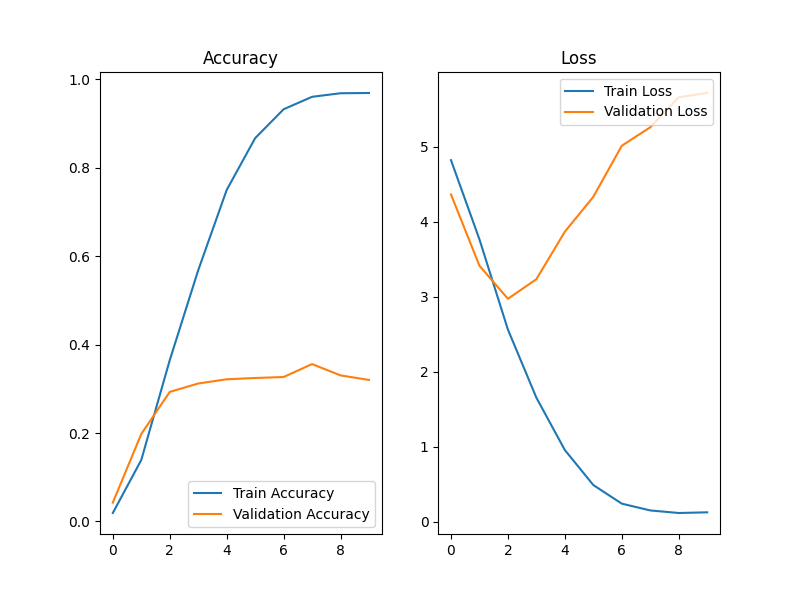
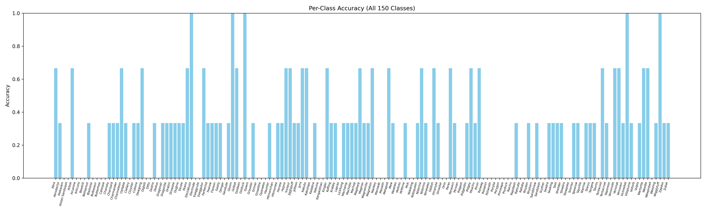

# Assignment 4 - DL/CNN
- Name: Connie Tang Ming Xin
- Matric Number: MEC245051

---
# STUDENT OUTCOME:
## Pokémon classification
>Dataset sourced: From Kaggle - [link](https://www.kaggle.com/datasets/lantian773030/pokemonclassification?)

>CNN model applied: TensorFlow CNN model (sequential) - [link](https://www.tensorflow.org/tutorials/images/cnn)
- Model: "sequential"

| Layer (type)             | Output Shape       | Param #   |
|--------------------------|--------------------|-----------|
| conv2d (Conv2D)          | (None, 180, 180, 16) | 448       |
| max_pooling2d            | (None, 90, 90, 16)   | 0         |
| conv2d_1 (Conv2D)        | (None, 90, 90, 32)   | 4,640     |
| max_pooling2d_1          | (None, 45, 45, 32)   | 0         |
| conv2d_2 (Conv2D)        | (None, 45, 45, 64)   | 18,496    |
| max_pooling2d_2          | (None, 22, 22, 64)   | 0         |
| flatten (Flatten)        | (None, 30976)        | 0         |
| dense (Dense)            | (None, 128)          | 3,965,056 |
| dense_1 (Dense)          | (None, 150)          | 19,350    |

**Total params:** 4,007,990 (15.29 MB)  
**Trainable params:** 4,007,990 (15.29 MB)  
**Non-trainable params:** 0 (0.00 B)

---

## Implementation
### step 0. Git clone this repository to local

### step 1. Set up environment:
>Use **'anaconda'** to create an envs
```bash
conda create --name POKEMON python=3.12
```

> Activate the environment:
```bash
conda activate POKEMON
```

>pip install all the requested packages:
```bash
pip install pandas matplotlib seaborn scikit-learn
pip install tensorflow
pip install tqdm
pip install opencv-python
pip install icrawler
```

### step 2. Download the Pokémon dataset from [Kaggle](https://www.kaggle.com/datasets/lantian773030/pokemonclassification?).
> Rename the directory as 'pokemon_dataset'

### Step 3. Run [train].py 
>To get the trained model that is saved as **'pokemon_cnn_model_manual.keras'**

### Step 4. Run [test].py
>To test the saved model accuracy from unseen (real-world) images
---

## Result:
### 1. Training Result:


### 2. Per-class accuracy (all 150 classes)


### 3. Detailed Accuracy Table
- [Click here to view/download the full per-class accuracy CSV](class_accuracy_summary.csv)

**Preview:**

   | Class Name  | Total | Correct | Accuracy |
   |-------------|--------|---------|----------|
   | Abra        | 3      | 2       | 0.6667   |
   | Aerodactyl  | 3      | 1       | 0.3333   |
   | Alakazam    | 3      | 0       | 0.0000   |
   | ...         | ...    | ...     | ...      |
   
---

## Conclusion:
> When classifying 150 Pokémon classes:
- Test Accuracy for New Unseen Images: 28.73%
> Suggestions help to enhance model accuracy:
- Training for more epochs
- Using pre-trained models like MobileNet or ResNet
- Applying data augmentation
